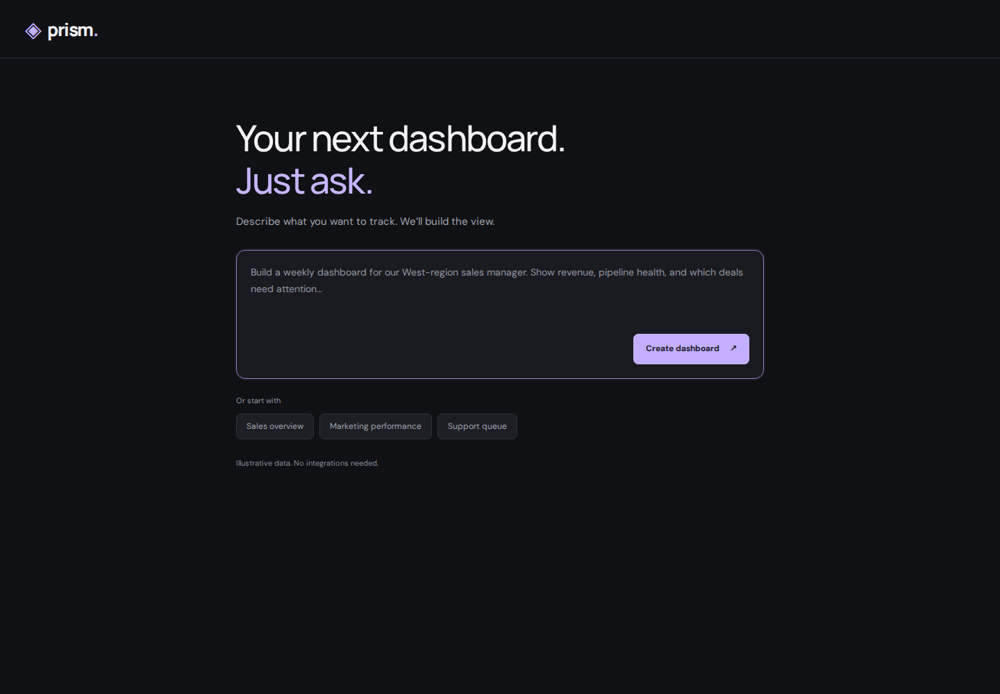
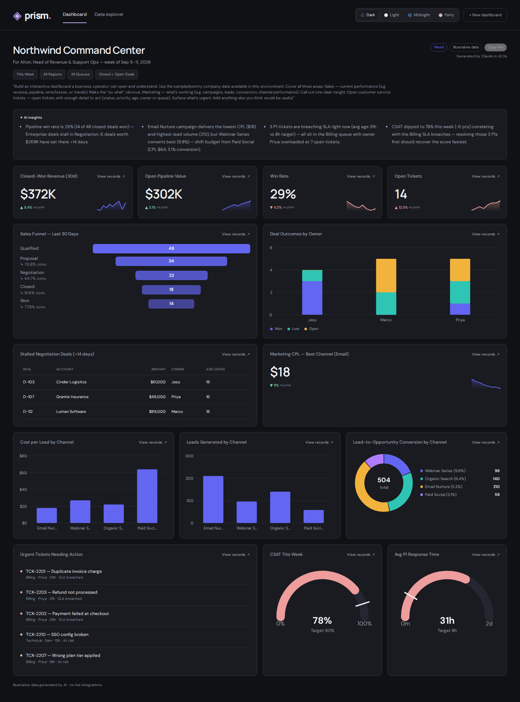
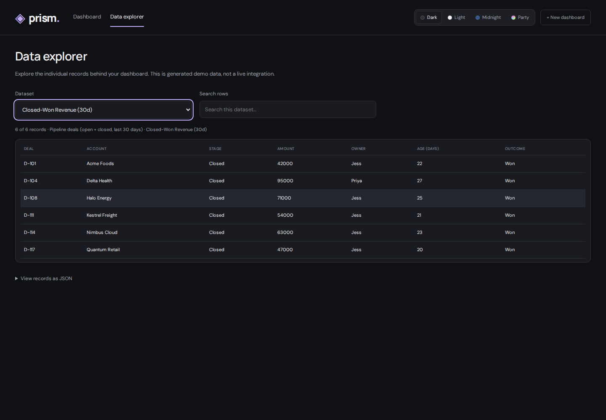
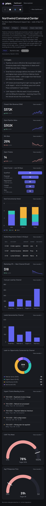

# prism — the dynamic dashboard agent

Type one sentence about sales, marketing or the support queue; Claude designs and renders a whole
dashboard for it. Illustrative data, no live integrations.

Built 2026-09-11 for the hackathon. Ran publicly behind a Cloudflare tunnel until it was
retired on 2026-09-12 (ingress rule + CNAME removed, `dashboard-agent` user unit disabled). All the
code is kept here for redeployment.

## Screenshots

Captured 2026-09-19 against a local run at `http://127.0.0.1:8097`, from the stored dashboard
`fbfhyjw41j` (the last one ever generated through the frontend).

### Landing — the one-sentence prompt



### Generated dashboard — the main output

A 14-widget dashboard built from a single request: AI insights, KPI tiles with sparklines, a sales
funnel, stacked deal outcomes, a stalled-deals table, marketing channel charts, the urgent-ticket
list and gauges. Every widget links through to the records behind it.



### Data explorer — the records behind a widget

Clicking *View records* on any widget opens the underlying rows, searchable, with raw JSON.



### Mobile



## Running it

```sh
node app/server.js            # http://127.0.0.1:8097
```

or as the installed systemd **user** unit:

```sh
systemctl --user enable --now dashboard-agent
journalctl --user -u dashboard-agent -f
```

Making it public again needs a fresh ingress rule on the named tunnel plus a proxied
CNAME — quick `trycloudflare` tunnels are retired.

## Layout

| Path | What it is |
| --- | --- |
| `app/server.js` | zero-dependency Node server; `POST /api/dashboard`, `/api/recent`, `/api/health`, `/d/<id>` permalinks |
| `app/public/` | frontend (`index.html`, `app.js`, CSS, sample specs); read per request, no restart needed |
| `app/data/` | one JSON payload per generated dashboard, keyed by id |
| `app/requests.log` | one JSON line per submission (ip, prompt, id, latency, widget count) |
| `app/record-fallback.js` | deterministic spec used when Claude is slow, busy or errors — a judge never sees a blank page |
| `app/verify-browser.cjs`, `app/verify-record-drilldown.cjs` | Playwright checks (`PLAYWRIGHT_MODULE=/path/to/playwright node app/verify-browser.cjs`) |
| `goal.md`, `chathistory.md`, `judge-prompts.md` | the brief, the multi-agent build log, the judging prompts |
| `recovered-prompts/` | the last five prompts submitted through the live frontend, one per file |

Claude is invoked headless (`claude -p`, sonnet-5, `MAX_THINKING_TOKENS=0` — thinking pushed a
generation from ~20s to 58s).
